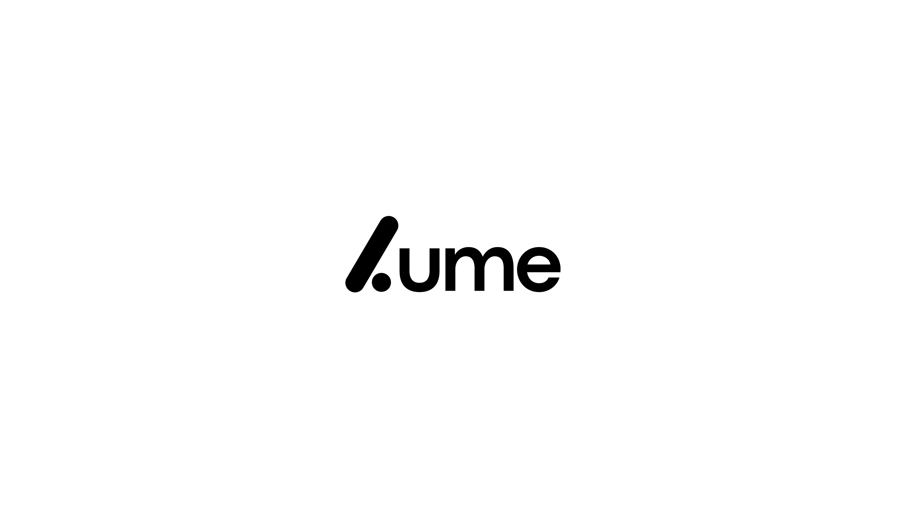

<p align="center">
  <strong>Anonymous end-to-end encrypted messenger.</strong><br>
  X3DH key agreement &middot; Double Ratchet &middot; Zero plaintext on server
</p>

<p align="center">
  
  
  
  
  
</p>

---

### What is LUME?

A messenger where the server is a blind relay. It stores and forwards encrypted blobs — it cannot read messages, decrypt files, or access keys. All crypto runs on the client.

---

### Features

<table>
<tr>
<td align="center"><strong>Privacy</strong></td>
<td align="center"><strong>Communication</strong></td>
<td align="center"><strong>Security</strong></td>
</tr>
<tr>
<td>


</td>
<td>


</td>
<td>


</td>
</tr>
</table>

---

### Stack

<p>
  
  
  
  
  
</p>
<p>
  
  
  
  
</p>
<p>
  
  
  
  
</p>

---

### Quick start

```bash
git clone https://github.com/umaiw/LUME.git && cd LUME

# server
cd server && cp .env.example .env && npm i && npm run dev

# client (new terminal)
cd client && cp .env.local.example .env.local && npm i && npm run dev
```

Or with Docker:

```bash
WS_JWT_SECRET=$(openssl rand -hex 32) docker compose up --build
```

---

<p align="center">
  <a href="docs/PROTOCOL.md"></a>
  <a href="SECURITY.md"></a>
  <a href="LICENSE"></a>
</p>
